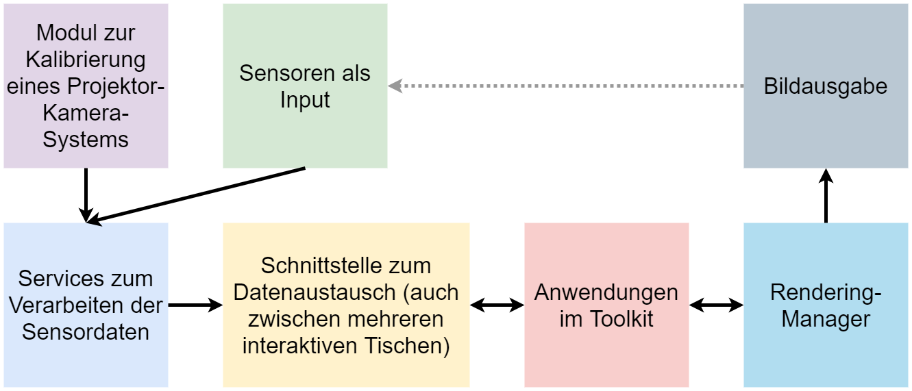

# VIGITIA Toolkit zum Erstellen von Projected-Augmented-Reality-Anwendungen auf Tischen

Dieses Toolkit entstand im Rahmen der Masterarbeit von Vitus Maierhöfer im Forschungsprojekt VIGITIA 
(https://vigitia.de/) am Lehrstuhl für Medieninformatik der Universität Regensburg.



# Installationsanleitung (Linux):

Für das Toolkit müssen einige Abhängigkeiten installiert werden, siehe Anleitung hier. 
Diese sind auch für Windows und macOS verfügbar und können entsprechend der Anleitungen auf den jeweiligen Homepages für diese Betriebssysteme installiert werden.

#### Abhängigkeiten:

```
sudo apt-get install python3-pip python3-numpy
```

```
sudo apt-get install gstreamer1.0*
sudo apt install libgstreamer1.0-dev libgstreamer-plugins-base1.0-dev

sudo apt-get install build-essential
sudo apt-get install cmake git libgtk2.0-dev pkg-config libavcodec-dev libavformat-dev libswscale-dev
sudo apt-get install python-dev python-numpy libtbb2 libtbb-dev libjpeg-dev libpng-dev libtiff-dev libdc1394-22-dev
```

#### Installation von OpenCV in der korrekten Version mit GStreamer Support und dem opencv_contrib-Modul

```
git clone https://github.com/opencv/opencv.git
git clone https://github.com/opencv/opencv_contrib.git
cd opencv_contrib 
git checkout 4.4.0
cd ..
cd opencv/
git checkout 4.4.0

mkdir build
cd build

cmake -D CMAKE_BUILD_TYPE=RELEASE \
-D CMAKE_INSTALL_PREFIX=/usr/local \
-D INSTALL_PYTHON_EXAMPLES=ON \
-D INSTALL_C_EXAMPLES=OFF \
-D PYTHON_EXECUTABLE=$(which python3) \
-D BUILD_opencv_python2=OFF \
-D CMAKE_INSTALL_PREFIX=$(python3 -c "import sys; print(sys.prefix)") \
-D PYTHON3_EXECUTABLE=$(which python3) \
-D PYTHON3_INCLUDE_DIR=$(python3 -c "from distutils.sysconfig import get_python_inc; print(get_python_inc())") \
-D PYTHON3_PACKAGES_PATH=$(python3 -c "from distutils.sysconfig import get_python_lib; print(get_python_lib())") \
-D WITH_GSTREAMER=ON \
-D OPENCV_EXTRA_MODULES_PATH=/home/vigitia/opencv_contrib/modules /home/vigitia/opencv/ \
-D BUILD_EXAMPLES=ON ..

sudo make -j<NUMBER OF CORES IN CPU, e.g. 4>
sudo make install
sudo ldconfig```

```
#### Weitere nötige Python-Bibliotheken
```
pip3 install PyQt5==5.10
pip3 install pyrealsense2
pip3 install python-osc
pip3 install cvlib
pip3 install scipy
pip3 install tensorflow
pip3 install scikit-learn
```


# Arbeiten mit dem Toolkit

## Kurzüberblick:

Initial:
 - Hardwaresetup bauen
 - Kamera(s) im SensorProcessingController auswählen
 - Kameras mti dem Kalibrierungstool kalibrieren
 - Gewünschte SensorProcessingServices im SensorProcessingController auswählen
 - Gewünschte Anwendungen zum /applications-Ordner hinzufügen
 
Jedes Mal:
 - SenserProcessingController starten, damit die Sensordaten ausgewertet und verschickt werden
 - RenderingManager starten, damit die Anwendungen geladen und angezeigt werden

#### 1: Hardwaresetup

Für das Toolkit werden als Grundvoraussetzung ein Projektor und eine RGB-Kamera
benötigt. Für die Erkennung von Touch-Events ist zudem mit den aktuell implementierten SensorProcessingServices eine beliebige Tiefenkamera von Nöten. Der Projektor muss so montiert werden, dass er auf die gewünschte Projektionsfläche projizieren kann. Für die Montage der Kamera ist nur entscheidend, dass der gesamte
Projektionsbereich in deren Blickfeld liegt.

#### 2: Kalibrieren des Systems

Starte calibration/TableSurfaceselector.py, um das Kalibrierungstool zu starten

#### 3: Konfigurieren und Starten des SensorProcessingControllers

In der Klasse SensorProcessingController.py können aktive Kameras und SensorProcessingServices definiert werden. Der Code gibt hierbei Anleitungen und Erklärungen, wie dies funktioniert.


#### 4: Konfigurieren und Starten des RenderingManagers

Startet man die Klasse RenderingManager.py, werden alle Anwendungen im /applications-Ordner automatisch geladen.
Im Code der Klasse können Anwendungen zudem auf eine Blacklist gesetzt werden.


#### 5: Eine eigene Anwendung implementieren

Bestehende Anwendungen können zum Toolkit hinzugefügt werden, indem sie in den /applications-Ordner im Root-Verzeichnis des Toolkits verschoben werden. Um eine neue Anwendung zu implementieren, genügt es, ein neues Python-Skript in diesem Ordner anzulegen. Um sich das Schreiben von BoilerplateCode zu sparen, kann das vorgegebene Anwendungstemplate verwendet werden (siehe /templates/TookitApplication.py). Alternativ ist es auch möglich, eine der mit dem Toolkit bereitgestellten Beispielanwendungen für den gewünschen Anwendungsfall zu erweitern.

#### 6: Einen neuen SensorProcessingService implementieren

Falls das Toolkit eine gewünschte Funktionalität zum Verarbeiten der Sensordaten noch nicht bereitstellt, kann es aufgrund des modularen Designs jederzeit erweitert werden. Alle SensorProcessingServices befinden sich - analog zu Anwendungen - in einem eigenen Ordner im Root-Verzeichnis des Toolkits. Auch für einen Service wird ein Template bereitgestellt, das die nötigen Methodenrümpfe bereits beinhaltet. Neue SensorProcessingServices müssen im SensorProcessingController registriert werden. Anschließend werden sie von diesem mit den benötigten Sensordaten versorgt. Falls die verarbeiteten Daten über die TUIO-Schnittstelle ausgetauscht werden sollen, müssen diese noch in das TUIO-Nachrichtenformat konvertiert werden. Die bereits implementierten SensorProcessingServices zeigen anschaulich auf, wie dies funktioniert.

#### 7: Vernetzung mehrerer interaktiver Tische
Falls Daten an einen entfernten interaktiven Tisch gesendet werden sollen, muss je
nach Art der auszutauschenden Daten nur eine neue Instanz eines TUIO-Servers
oder eines Video-Streamers im SensorProcessingController angelegt werden. Dafür ist
im Toolkit jeweils nur eine Zeile Code notwendig. Das Versenden von Daten über
die implementierten Schnittstellen gestaltet sich ebenfalls als sehr einfach, wie folgendes Beispiel zeigt:

```
# Init a new TUIO-Server
self.tuio_server = TUIOServer(TARGET_COMPUTER_IP, TARGET_COMPUTER_PORT)

# Init a new Video Streamer
self.video_streamer = VIGITIAVideoStreamer(TARGET_COMPUTER_IP, TARGET_COMPUTER_PORT)

# Create and send a TUIO Bundle containing one Bounding Box Message
self.tuio_server.start_tuio_bundle()
self.tuio_server.add_bounding_box_message(s_id=0, x_pos=0, y_pos=0, angle=0, width=0, height=0, area=0)
self.tuio_server.send_tuio_bundle()

# Stream the current frame
self.video_streamer.stream_frame(frame)
```
